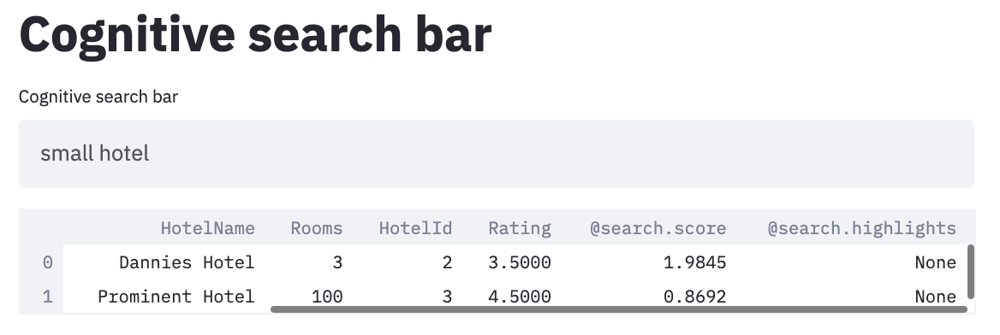

Productionizing ML: build your own search engine

# Build your own search engine
There are many ways to put your data science work into production. But there is one thing they all have in common. It never comes easy. Every now and then you come across a pragmatic approach that is simple and works in standard occasions. I’m about to explain one of these. The use case we’re covering is building a private google like search engine and interface.

To get to this point we need an **analytics engine** to rank the documents we want to search through. We will use [Azure Cognitive Search](https://pypi.org/project/azure-search-documents/), but you could also choose alternatives such as [Elasticsearch](https://elasticsearch-py.readthedocs.io/en/master/). Also we must have a **user interface** to interact with the search engine, and to display results. We choose [Streamlit](https://www.streamlit.io/).Eventually we need to deploy the solution somewhere, and limit access to it with some **access management**. We decided to go with docker, as it is cloud agnostic. In this example however, we deploy the docker image with Azure App Services. With Azure Active Directory your can limit access to people within your network for example. 

## Dependencies
To build your own search enging you must have an [Azure subscription](https://azure.microsoft.com/en-us/free/) and create an [Azure Cognitive Search service](https://docs.microsoft.com/en-us/azure/search/search-create-service-portal). Follow the links to get set up.
Additionally you need to install [Docker](https://docs.docker.com/get-docker/) to run your solution on your machinie.


## Setting up the API
* Follow the [Manual](https://docs.microsoft.com/en-us/azure/search/search-create-service-portal) to create the service

* Read the [API documentation](https://pypi.org/project/azure-search-documents/#adding-documents-to-your-index) better understand the search engine.

## Setting up environment variables
To make sure your credentials do not end up in your code repositories, add your endpoint and secret from the search service to your environment variables (get them from the [azure portal](https://portal.azure.com/) or [Azure CLI](https://docs.microsoft.com/en-gb/cli/azure/install-azure-cli?view=azure-cli-latest))

I work on mac and added the following lines to my .bash_profile file. 
```
export ACS_API_KEY=<admin-key>
export SEARCH_ENDPOINT=<service url>
```
To make sure that they're loaded in your terminal run:
```
source ~/.bash_profile
```
If you work on a different Operating System, adding the environment variables might be different.

## Creating the following folder structure
To complete this tutorial, you'll  need to end up with the following folder structure
```
my-search-engine-demo
    ├── Dockerfile 
    ├── demo_environment.yml
    └── my-search-engine-demo
        ├── hotel_documents.json
        ├── hotel_index.py
        ├── initialize_acs.py
        └── user_interface.py
```
## The code
In ten steps, we will explain how to get your search engine running. The code can also be found in the Clone this example from the [repository](https://github.com/godatadriven/build-your-own-search-engine).

### Step 1: Create your environment file
Before we write any code, we will specify our dependencies in an environment file. We will use this file to let conda install the required dependencies in our Docker image later. Add the following to the #demo-environment.yml
```
#demo_environment.yml
name: acs_demo
channels:
  - conda-forge
  - defaults
dependencies:
  - pip=20.2.1
  - python=3.8.5
  - requests=2.24.0
  - setuptools=49.2.1
  
  - pip:
    - azure-search-documents==11.0.0
    - streamlit==0.64.0

```
### Step 2: Create your documents file
We want our search index to help us find relevant documents. For this demo, we are going to index information about hotels, but this can be any type of information.
```
# hotel_documents.json
[
  {
    "HotelId": "1",
    "HotelName": "Seaside Inn",
    "Rating": 4.1,
    "Rooms": 5,
    "Description": "This wonderfull little in is located at a 2 minute walk from the beach"
  },
  {
    "HotelId": "2",
    "HotelName": "Dannies Hotel",
    "Rating": 3.5,
    "Rooms": 3,
    "Description": "Dannies is a small hotel in the country side."
  },
  {
    "HotelId": "3",
    "HotelName": "Prominent Hotel",
    "Rating": 4.5,
    "Rooms": 100,
    "Description": "High end luxury hotel in an expensive neighbourhood"
  }
]

### Step 3: Create your index file
The search API requires a predefined index. In this index you specify which fields can be inspected in the documents that you will upload. You can also state the data types, how text fields should be analyzed and many more optios. We must define the index based on the documents that we want to index. For now, just create the hotel_index.py with the following code:
```
#hotel_index.py
from azure.search.documents.indexes.models import ( 
    ComplexField, 
    CorsOptions, 
    SearchIndex, 
    ScoringProfile, 
    SearchFieldDataType, 
    SimpleField, 
    SearchableField 
)

name = "hotels"
fields = [
        SimpleField(name="HotelId", type=SearchFieldDataType.String, key=True),
        SearchableField(name="HotelName", type=SearchFieldDataType.String,analyzer_name='en.lucene'),
        SearchableField(name="Description", type=SearchFieldDataType.String,analyzer_name='en.lucene'),
        SimpleField(name="Rating", type=SearchFieldDataType.Double),
        SimpleField(name="Rooms", type=SearchFieldDataType.Int32),
        
    ]


index = SearchIndex(
    name=name,
    fields=fields,
)
```


```
### Step 4: Create your initialization script
Uptil now, the search API does not know about the index and the documents yet. Therefore it must be initialized. We will first initalize the index, and then upload our documents to the search engine. It will then index the documents according to the index that you provided. Create the initialize_acs.py as follows:

```
# initialize_acs.py
import json
import os

from azure.core.credentials import AzureKeyCredential
from azure.core.exceptions import HttpResponseError
from azure.search.documents import SearchClient
from azure.search.documents.indexes import SearchIndexClient

from hotel_index import index

index_name = "hotels"
endpoint = os.environ["SEARCH_ENDPOINT"]
credential = AzureKeyCredential(os.environ["ACS_API_KEY"])


def initialize_index(endpoint:str, index:str, credential:str):
    """Create a search index

    Args:
        endpoint (str): url to azure cognitive search
        index (str): document index
        credential (str): azure cognitive search admin-key
    """
    client = SearchIndexClient(endpoint, credential)
    try:
        result = client.create_index(index)
    except HttpResponseError:
        pass


def upload_documents(endpoint:str, index_name:str, credential:str, documents:str):
    """Upload files that must be indexed

    Args:
        endpoint (str): url to azure cognitive search
        index_name (str): document index name
        credential (str): azure cognitive search admin-key
        documents (str): json file with documents according to the index schema
    """
    search_client = SearchClient(
        endpoint=endpoint, index_name=index_name, credential=credential
    )
    abspath = os.path.join(os.path.dirname(os.path.abspath(__file__)), documents)

    with open(abspath) as json_file:
        documents = json.load(json_file)

    result = search_client.upload_documents(documents=documents)


if __name__ == "__main__":
    initialize_index(endpoint, index, credential)
    upload_documents(endpoint, "hotels", credential, "hotel_documents.json")

```
To initialize the API, run the file
```
python my-search-engine-demo/initialize_acs.py
```

### Step 5: Create your user interface script
For the user interface, we want a search bar, and a list with tanked results. We will create them with Streamlit. To connect the interface with the API, we will connect to the search API and send the search query to it. The results that come back will be rendered as a dataframe. To replicate the UI, create the user_interface.py as follows: 

```
# user_interface.py

import os

import pandas as pd
from azure.core.credentials import AzureKeyCredential
from azure.search.documents import SearchClient

import streamlit as st

st.title("Cognitive search bar")

search_text = st.text_input(
    "Cognitive search bar", value="luxury", max_chars=None, key=None, type="default"
)


index_name = "hotels"
endpoint = os.environ["SEARCH_ENDPOINT"]
credential = AzureKeyCredential(os.environ["ACS_API_KEY"])


search_client = SearchClient(
    endpoint=endpoint, index_name=index_name, credential=credential
)

results = search_client.search(search_text=search_text)
results_df = pd.DataFrame([r for r in results])

search_output = st.dataframe(results_df)

```
To test if everything is working, you can run the app locally:
```
conda env create -f environment.yml
conda activate my-search-engine-demo
streamlit run my-search-engine-demo/user_interface.py
```
### Step 6: Create your Dockerfile
Now we've tested our app locally and verified that everything is working it's time to make it deployable. We will create a docker image where we install the dependencies and our app. 
```
# Dockerfile
FROM continuumio/miniconda3
EXPOSE 8501

# Copy files
COPY . .
# Install dependencies
RUN conda env create -f demo_environment.yml
# Activate conda environment
SHELL ["conda", "run", "-n", "my-search-engine-demo", "/bin/bash", "-c"]

# Run the interface
CMD streamlit run ./my-search-engine-demo/user_interface.py
```
### Step 7: Run your application
To build the docker image run:
```
docker build -t my-search-enginge-demo:latest .
```

To run the image in a docker container:
```
docker run -p 8501:8501 --env ACS_API_KEY=${ACS_API_KEY} --env SEARCH_ENDPOINT=${SEARCH_ENDPOINT} my-search-enginge-demo:latest
```

### Step 8: Test your application
Your application should now be running on localhost:8501. When you navigate there you should see something like this:


You can enter queries in the search bar, and the results will be returned in the interface.


### Step 9: Deployment
[Deploy and run a container app service](https://docs.microsoft.com/en-us/learn/modules/deploy-run-container-app-service/)
Add the image to Azure container registry
Create a web app based on the image
Put it behind active directory.

### Limitations
* The functionality of your app is limited to the functionality that streamlit provides.
* The solution is intended for a limited audience and limited loads. Scalability is therefore limited.
* There is no monitoring in place 


### Do it yourself!
Obviously, with three documents, this is only the start. Clone this example from the [repository](https://github.com/godatadriven/build-your-own-search-engine) and adjust the index and documents to match your requirements. Play around with the search api to finetune your results and you should have your own search engine up and running in no time!

Also, when we look at our approach from a higher level, you might notice that you could replace the analytics engine with something else. A different python package for example. At GoDataDriven we often build specific python packages for our clients, making this approach applicable to multiple use cases.
The same is true for the interface. For now we used Streamlit, but you can replace this with different interfaces when your requirments demand so. 

# Conclusion
In this blog, we've showed that it is possible to build a simple analytics engine with and interface with python. We've also shown that deploying it as a minimal viable product is not too complex when we use Azure App Services. In the process we've seen to use Azure Cognitive Search to build your own search engine. You can change the analytics engine, with any python package or API

I hope that you will put this tutorial to creative use in the future!

Good luck!


