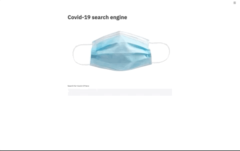
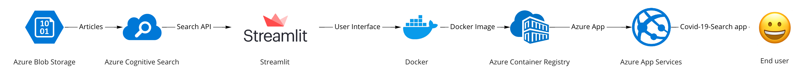
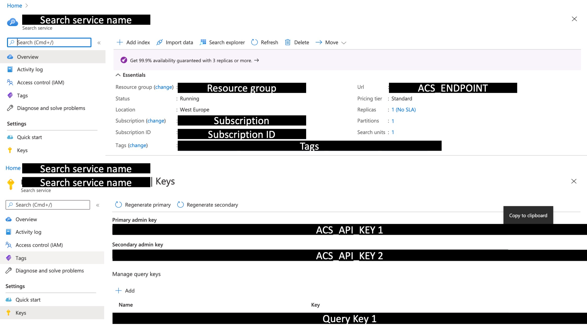

# How to build your own Covid-19 search engine

The amount of information around us is ever increasing, over 3 million blogs are published on the web everyday(Internetlivestats, 2020). Google became great by indexing this information. They created a search engine to find the most relevant websites based on a search query. With this search engine they processes over a whopping 3.5 billion searches per day (Internetlivestats, 2020). 

At the same time, today, Covid-19 has the world in its grip. While we measure and observe the progress of the disease, the world learns a little every day. These learnings get published in papers, articles and blogs all over the world. Making me curious what is out there to find. I intended to write a blog on building a search engine, and when I stumbled on a dataset with 550K articles about Covid-19 [here](https://aylien.com/coronavirus-news-dataset/) the deal was done. I build a search engine to search through these articles and in this blog I'll share how I did it. You can find the [result](https://covid-19-search.azurewebsites.net/) here.

It looks something like this:



To build this solution I made use of the following technology:

* The search engine: [Azure Cognitive Search](https://azure.microsoft.com/en-us/services/cognitive-services/)
* Data storage: [Azure Blob Storage](https://azure.microsoft.com/en-us/services/storage/blobs/)
* The User interface: [Docker](https://www.docker.com/) and [Streamlit](https://www.streamlit.io/)
* Deployment: [Azure Container Registry](https://azure.microsoft.com/en-us/services/container-registry/) and [Azure App Services](https://azure.microsoft.com/en-us/services/app-service/)

I stored the articles in the blob storage and used the cognitive search API to index them. Then I created a simple user interface with a search bar. The search bar sends the search query to the cognitive search API, which returns the most relevant results. To deploy this interface, I embedded it in a docker image which I pushed to the Azure Container Registry. Azure App Services could then deploy this image as a website, which can be found [here](https://covid-19-search.azurewebsites.net/). A schematic visualisation of the solution is shown below.



# The code
Before we start clone the [code repository](https://github.com/godatadriven/build-your-own-search-engine) to a folder on your computer. Which minor changes you can tweak it to create you own search engine with different files. Navigate to the build-your-own-search-engine.

```
cd build-your-own-search-engine 
```

# The dataset
Lets look at the dataset first to get an idea what we are dealing with. The dataset contains over 1.5 Million Covid-19 related articles. They are gathered over a period from Nov 2019 to July 2020 from ~440 global sources. You can download the full set [here](https://blog.aylien.com/free-coronavirus-news-dataset/) (please note it is >7 GB).

I'm interested in the following information:
* Identifier: to uniquely identify the documents
* Timestamp: to sort the articles on recency
* Source: to check where the data comes from
* Article title: to index the article on & show as a search result
* Article body: to index the article on & show as a search result

When you've downloaded the dataset, unpack it and put it in the data folder in the cloned directory. Open a terminal, go to the data folder and run 

```
python preprocessing_sample.py
```

This will create a file called "aylien_covid_news_data_sample.jsonl". In this file there are 50 sample records. If you want all the data, run the preprocessing_all.py script instead. This will create a set of files containing 100K documents each.

# The blob storage
We need to store the data in the Azure Blob Storage. If you don't have an azure account, [subscribe for free](https://azure.microsoft.com/en-us/free/). First [create a storage account](https://docs.microsoft.com/en-us/azure/storage/common/storage-account-create?tabs=azure-portal) and then [create a container](https://docs.microsoft.com/en-us/azure/storage/blobs/storage-quickstart-blobs-portal). Then upload the created "aylien_covid_news_data_sample.jsonl" file into the container.

Look up the storage account connection string and register it on your machine as an environmental variable (for me on a macbook I added the following line to the .bash_profile file). On Mac, you can find this file in your /Users/username folder. If you get stuck here, google on how to add environmental variables for your operating system.

You can find your connection string on the azure portal here:


Make sure to remove the part after ==; so that it looks something like this:

```
export SA_CONN_STR='DefaultEndpointsProtocol=https;AccountName=XXX;AccountKey=XXX==;'
```

In the storage account, create a container called covid-news

# The search engine
This is all about the indexation of the articles. To index them we must:
* Create a data source [read the docs](https://docs.microsoft.com/en-us/rest/api/searchservice/create-data-source)
* Create an index [read the docs](https://docs.microsoft.com/en-us/rest/api/searchservice/create-index)
* Create an indexer [read the docs](https://docs.microsoft.com/en-us/rest/api/searchservice/create-indexer)
* Run the indexer [read the docs](https://docs.microsoft.com/en-us/rest/api/searchservice/run-indexer)

I've created a script for you that takes care of this. But before you can run it, you have to create the search service. 
In the azure portal, navigate to the azure search service. Create a new search service. Write down the url from the overview page. This is the ACS_ENDPOINT. Then nevigate to the keys tab in the pane on the left. The primary admin key is your ACS_API_KEY. Also add your client ip in the networking tab. Do not forget to hit save.

Register the ACS_ENDPOINT and ACS_API_KEY on your machine as  environmental variables.

You can find them from the Azure portal here:


When exporting your environmental variables please note the trailing slash in the ACS_ENDPOINT.

```
export ACS_API_KEY=XXX
export ACS_ENDPOINT='https://XXX.search.windows.net/'
```

Please note the '/' at the end of the ACS_ENDPOINT.

When you have added the environmental variables open a new terminal and run the setup script:

First install the dependencies. You probably want to do this in a virtual environment E.g.
```
virtualenv <name_env>
source activate <name_env>
pip install -r my-search-engine-demo/requirements.txt
```

```
python my-search-engine-demo/my-search-engine-demo/setup_acs.py
```
This will trigger the indexation process. Wait until you see 'Indexer created correctly...' and some fance ASCII art which tells you that the indexation is done.

If you are running into timeout errors, please check if your IP is whitelisted from the networking settings in the azure portal for in Azure Cognitive Search. If not, please add your IP.

# The user interface
For the user interface we will create a streamlit app. According to their website: 

> "Streamlit’s open-source app framework is the easiest way for data scientists and machine learning engineers to create beautiful, performant apps in only a few hours!  All in pure Python. All for free.""

Let's put that to the test then shall we? Check out the "my-search-engine-demo/my-search-engine-demo/user_interface.py" file in the repository to check out how the user interfacve is made.

The paginator and download results functions are nice to haves. So you can leave them out. The essentials are the following

1) Create a title
2) Render an image
3) Create the search bar
4) Load the API secrets
5) Send the search query to the API
6) Render the results

You can try it out locally by running:
```
streamlit run my-search-engine-demo/my-search-engine-demo/user_interface.py
```

# Deploying your user interface

## Docker
For this part you need to [install Docker](https://docs.docker.com/get-docker/) on your local machine. 

According to their website:
> "Docker is an open platform for developing, shipping, and running applications. Docker enables you to separate your applications from your infrastructure so you can deliver software quickly."

What we will do is create a docker image. On this image, we will install the required dependencies, and copy and the required code for the user interface.

We build the image by running:
```
docker build --build-arg BUILDTIME_ACS_API_KEY=${ACS_API_KEY} --build-arg BUILDTIME_ACS_ENDPOINT=${ACS_ENDPOINT} --build-arg BUILDTIME_SA_CONN_STR=${SA_CONN_STR} -t covid-19-search:latest .
```
This way we create a docker image tagged with "my-search-engin-demo:latest". The environmental variables will be copied into the image.

To test if your image was build correctly run it locally:
```
docker run -p 80:80 covid-19-search:latest
```
You should now be able to access the user interface from your browser with localhost:80. 

## Azure Container Registry
Now we must create an [azure container registry](https://docs.microsoft.com/en-us/azure/container-registry/container-registry-get-started-portal). Write down the server name, which is something like "XXX.azurecr.io

From the access keys menu, enable admin and write down the username and password to be able to log into the server.

Now it is time to push the image to the registry. First, we tag our image with the login server/image name:tag. 

```
docker tag covid-19-search:latest {login server}/{image name}:{tag}
```
It will look something like "XXX.azurecr.io/covid-19-search:latest"

Second we log into the server
```
docker login <<servername e.g. XXX.azurecr.io>> 
```
Third, we push our image to the server:
```
docker push server/image name:tag
```

You should now see the image in your Container Registry repository. 

## Azure App Services
You are almost there! The last step is to publish the image as a webpage accessible from the internet.

1) In the Azure Portal, go to azure app services and add a web app.

2) Enter a name for your new web app, and select or create a new Resource Group. For the OS, choose Linux.

3) Choose Configure container and select Azure Container Registry. Use the drop-down lists to select the registry you created earlier, and the Docker image and tag that you generated earlier.

Now create your service. When your service is created head to the service URL to access your website!

The above steps should look something like:


If the website is accessible, but the search bar does not show, please try a more expensive plan. You can scale down again after. This is a bug.

# Conclusion
In this blog, we have seen how we can index articles with the Cognitive Search API. We have learned how to use streamlit to interact with the search engine. And we have seen how to dockerize and deploy the solution as a web app. I hope that by reading this blog you have gained one of these three insights.
1) You have found relevant information regarding Covid-19
2) You have identified an opportunity to alter this solution to a different dataset
3) You have identified an opportunity to alter this solution to replace the search engine with a different analytics engine

If you did, don't hesitate to share! I'd love to hear about it. 