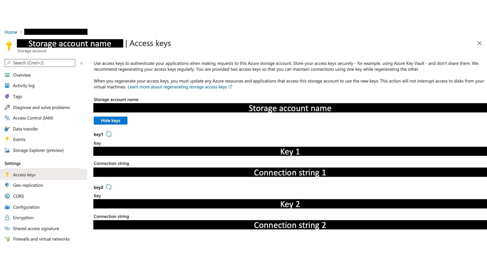
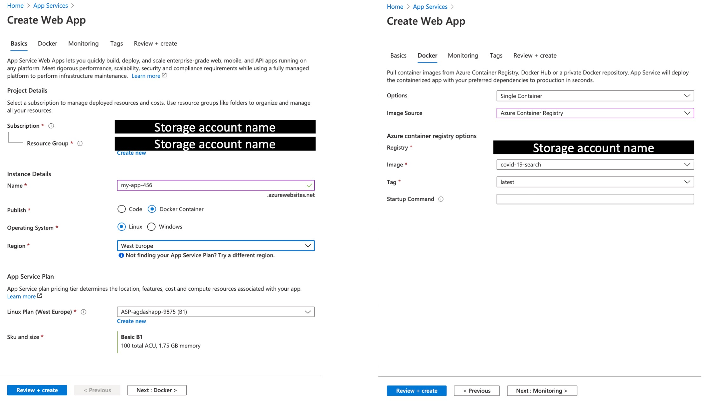

# How to build your own Covid-19 search engine

The amount of information around us is ever increasing, over 3 million blogs are published on the web every day (Internetlivestats, 2020). Google has become great at indexing all of this information, allowing their search engine to find the most relevant websites using only simple textual search queries. Google is currently processing over a whopping 3.5 billion searches per day (Internetlivestats, 2020) and with the world being in the grip of the current pandemic, increasing part of this information is concerned with Covid-19. 

All around the world, people are continually measuring and observing the progress of the Covid-19 pandemic. The disease still poses many questions, and every day we learn about a new piece of the puzzle. These incremental learnings get published in papers, articles and blogs all over the web. This made me curious if I could bring together some of these learnings, and somehow gain more insight into the pandemic. In my quest I stumbled across [this](https://aylien.com/coronavirus-news-dataset/) dataset with 550K articles about Covid-19. For me, this sealed the deal: I was going to build myself a search engine for searching through all these Covid-19 related articles. This way creating my own tool for trying to better understand the pandemic! In this blog I'll share how I did it. For those of you who cannot wait, click [here](https://covid-19-search.azurewebsites.net/) to already check it out.

# Anatomy of an Covid-19 Search Engine
In the end my Covid-19 search engine ended up looking like this:


To build this solution I made use of the following technology:

* Search engine: [Azure Cognitive Search](https://azure.microsoft.com/en-us/services/cognitive-services/)
* Data storage: [Azure Blob Storage](https://azure.microsoft.com/en-us/services/storage/blobs/)
* User interface: [Docker](https://www.docker.com/) and [Streamlit](https://www.streamlit.io/)
* App Deployment: [Azure Container Registry](https://azure.microsoft.com/en-us/services/container-registry/) and [Azure App Services](https://azure.microsoft.com/en-us/services/app-service/)

Let me first provide you with an outline of the overall process of how I developed the solution. I started out by storing the articles in the blob storage, using the cognitive search API to index all of them. Then I created a simple user interface with a search bar for entering queries. The search bar sends the search query to the cognitive search API, which returns the most relevant results. To deploy the whole application, I embedded it in a docker image which I pushed to the Azure Container Registry. Azure App Services then deploys this image as a website, which can be found [here](https://covid-19-search.azurewebsites.net/). A schematic visualisation of the whole solution is shown below.


In the coming sections I will go through each step in more detail, which should allow you to recreate the solution by yourself!

# Step 1: Get the code
Before we start, clone the [code repository](https://github.com/godatadriven/build-your-own-search-engine) to a folder on your computer. With minor changes you can tweak it to create your own search engine with different files. Use your terminal to navigate to the build-your-own-search-engine folder, here you can find all the code.

```
cd build-your-own-search-engine 
```

# Step 2: Get the data
Let’s look at the dataset first, to get an idea what we are dealing with. The dataset contains over 1.5 Million Covid-19 related articles. They are gathered over a period from Nov 2019 to July 2020 from ~440 global sources. You can download the full set [here](https://blog.aylien.com/free-coronavirus-news-dataset/) (please note it is >7 GB).

I'm interested in the following information:
* Identifier: to uniquely identify the documents
* Timestamp: to sort the articles on recency
* Source: to check where the data comes from
* Article title: to index the article on & show as a search result
* Article body: to index the article on & show as a search result

When you've downloaded the dataset, unpack it and put it in the data folder in the cloned directory. Open your terminal, go to the data folder and run 

```
python preprocessing_sample.py
```

This will create a file called "aylien_covid_news_data_sample.jsonl". In this file there are 50 sample records. If you want all the data, run the preprocessing_all.py script instead. This will create a set of files containing 100K documents each.

# Step 3: Store the data in the cloud
We need to store the data in the Azure Blob Storage. If you don't have an azure account, [subscribe for free](https://azure.microsoft.com/en-us/free/). First [create a storage account](https://docs.microsoft.com/en-us/azure/storage/common/storage-account-create?tabs=azure-portal) and then [create a container](https://docs.microsoft.com/en-us/azure/storage/blobs/storage-quickstart-blobs-portal). Make sure the name of the container is "covid-news" or alter the used container name in the setup_acs.py script later.
Finally, upload the created "aylien_covid_news_data_sample.jsonl" file into the container you have created.

Look up the storage account connection string. You can find your connection string on the azure portal here:


 
We need to register this string as an environment variable called `SA_CONN_STR` on your machine. First, make sure to only not use the part of the string after the `==;`. Then, add the following line to your `~/.bash_profile`, replacing the part between the quotes with the relevant part of your connection string: 

```
export SA_CONN_STR='DefaultEndpointsProtocol=https;AccountName=XXX;AccountKey=XXX==;'
```

Open a new terminal and check if your connection string is correctly stored as an environment variable by running:

```
echo $SA_CONN_STR
```

If you did it right, this should print the connection string. If you get stuck here, google on how to add environment variables to your operating system.

# Step 4: Build the search engine
This step is all about the indexation of the articles. To index them we must:
* Create a data source [read the docs](https://docs.microsoft.com/en-us/rest/api/searchservice/create-data-source)
* Create an index [read the docs](https://docs.microsoft.com/en-us/rest/api/searchservice/create-index)
* Create an indexer [read the docs](https://docs.microsoft.com/en-us/rest/api/searchservice/create-indexer)
* Run the indexer [read the docs](https://docs.microsoft.com/en-us/rest/api/searchservice/run-indexer)

I've created a script for you that takes care of this. But before you can run it, you have to create the search service.

In the azure portal, navigate to the azure search service. Create a new search service. Write down the url from the overview page. This is the ACS_ENDPOINT. Then navigate to the keys tab in the pane on the left. The primary admin key is your ACS_API_KEY. Also add your client ip in the networking tab. Do not forget to hit save!

Now, also register the ACS_ENDPOINT and ACS_API_KEY on your machine as environment variables.

You can find them from the Azure portal here:


When exporting your environmental variables please note the trailing slash in the ACS_ENDPOINT.

```
export ACS_API_KEY=XXX
export ACS_ENDPOINT='https://XXX.search.windows.net/'
```

Please note the '/' at the end of the ACS_ENDPOINT.

When you have added the environment variables open a new terminal and run the setup script:

First install the dependencies. You probably want to do this in a virtual environment E.g.
```
virtualenv <name_env>
source <name_env>/bin/activate
pip install -r my-search-engine-demo/requirements.txt
```

Then run the following command:

```
python my-search-engine-demo/my-search-engine-demo/setup_acs.py
```

This will trigger the indexation process. Wait until you see 'Indexer created correctly...' and some fancy ASCII art which tells you that the indexation is done.

If you are running into timeout errors, please check if your IP is whitelisted from the networking settings in the azure portal for in Azure Cognitive Search. If not, please add your IP.

# Step 5: Develop the user interface
For the user interface we will create a streamlit app. According to their website: 

> "Streamlit’s open-source app framework is the easiest way for data scientists and machine learning engineers to create beautiful, performant apps in only a few hours!  All in pure Python. All for free.""

Let's put that to the shall we? Check out the "my-search-engine-demo/my-search-engine-demo/user_interface.py" file in the repository to check out how the user interface is made.

The paginator and download results functions are nice to haves. So, you can leave them out if you want to. The essentials are the following

1) Create a title
2) Render an image
3) Create the search bar
4) Load the API secrets
5) Send the search query to the API
6) Render the results

You can try it out locally by running:
```
streamlit run my-search-engine-demo/my-search-engine-demo/user_interface.py
```

# Step 6: Deploy the user interface

### Docker image
For this part you need to [install Docker](https://docs.docker.com/get-docker/) on your local machine. 

According to their website:
> "Docker is an open platform for developing, shipping, and running applications. Docker enables you to separate your applications from your infrastructure so you can deliver software quickly."

What we will do is create a docker image. On this image, we will install the required dependencies, and copy and the required code for the user interface.

We build the image from the my-search-engine-demo/my-search-engine-demo directory by running:

```
docker build --build-arg BUILDTIME_ACS_API_KEY=${ACS_API_KEY} --build-arg BUILDTIME_ACS_ENDPOINT=${ACS_ENDPOINT} --build-arg BUILDTIME_SA_CONN_STR=${SA_CONN_STR} -t covid-19-search:latest .
```

This way we create a docker image tagged with "my-search-engin-demo:latest". The environmental variables will be copied into the image.

To test if your image was build correctly run it locally:
```
docker run -p 80:80 covid-19-search:latest
```
You should now be able to access the user interface from your browser with localhost:80. 

### Azure Container Registry
Now we must create an [azure container registry](https://docs.microsoft.com/en-us/azure/container-registry/container-registry-get-started-portal). Write down the server name, which is something like "XXX.azurecr.io

From the access keys menu, enable admin and write down the username and password to be able to log into the server.

Now it is time to push the image to the registry. First, we tag our image with the login server/image name:tag. 

```
docker tag covid-19-search:latest {login server}/{image name}:{tag}
```
It will look something like "XXX.azurecr.io/covid-19-search:latest"

Second, we log into the server
```
docker login <<servername e.g. XXX.azurecr.io>> 
```

Third, we push our image to the server:
```
docker push server/image name:tag
```

You should now see the image in your Container Registry repository. 

### Azure App Services
You are almost done! The last step is to publish the image as a webpage accessible from the internet.

1) In the Azure Portal, go to azure app services and add a web app.

2) Enter a name for your new web app and select or create a new Resource Group. For the OS, choose Linux.

3) Choose Configure container and select Azure Container Registry. Use the drop-down lists to select the registry you created earlier, and the Docker image and tag that you generated earlier.

Now create your service. When your service is created head to the service URL to access your website!

The above steps should look something like:


If the website is accessible, but the search bar does not show, please try a more expensive plan. You can scale down again after. This is a bug.

# Conclusion
In this blog, we have seen how you can build you own search engine by indexing articles with the Cognitive Search API. We have learned how to use streamlit to interact with the search engine. And we have seen how to dockerize and deploy the solution as a web app. 

I have learned a lot from building my own search engine! And, I hope that by reading this blog you have gained one of these three insights.
1) You have found relevant information regarding Covid-19
2) You have identified an opportunity to alter this solution to a different dataset
3) You have identified an opportunity to alter this solution to replace the search engine with a different analytics engine

If you did, don't hesitate to share! I'd love to hear about it.
